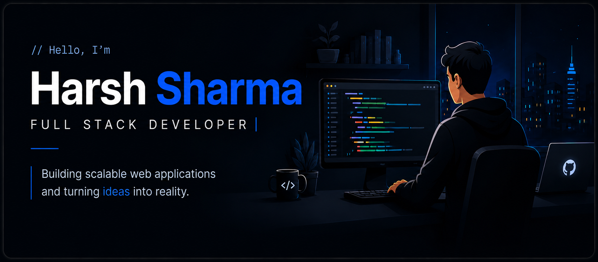

  

## 👋 Introduction

I'm an Electronics Engineering student at **NIT Kurukshetra** passionate about building scalable full-stack web applications and continuously improving my software development skills.

<table align="center" border="0">
<tr>
  
<td align="center" width="25%">
🌱 Learning   React, Node.js, PostgreSQL & TypeScript
</td>
<td align="center" width="25%">
🚀 Interested in   Scalable Web Applications & Backend Architecture
</td>
<td align="center" width="25%">
📚 Exploring   System Design & Cloud Computing
</td>
<td align="center" width="25%">
🎯 Working towards   Becoming a Software Engineer
</td>

</tr>
</table>

## 🛠 Technical Expertise

| **Category** | **Technologies** |
|----------|--------------|
| Languages |  |
| Frontend |  |
| Backend |  |
| Databases |  |
| Tools |  |

---

## 🚀 Featured Projects

### 💰 Expense Tracker Dashboard

> A full-stack expense management application that enables users to track income and expenses, visualize spending trends, and manage personal finances through an interactive dashboard.

#### Features

- JWT Authentication
- Dashboard Analytics
- Expense Categories
- Monthly Reports
- Responsive UI

#### Tech Stack

React • Node.js • Express • MongoDB • JWT • Chart.js

🔗 Live Demo

🔗 Repository

### ✅ Task Management System

> A productivity-focused task management application that helps users organize, prioritize, and track tasks through a clean and responsive interface.

#### Features

- JWT Authentication
- Create, Edit & Delete Tasks
- Task Priorities & Status Tracking
- Search & Filter Tasks
- Responsive UI

#### Tech Stack

React • Node.js • Express • MongoDB • JWT

🔗 Live Demo

🔗 Repository

---

## 📈 GitHub Analytics

 
   
   

 
    

## 📊 Contribution Activity

---

## 🎯 Current Focus

- 🚀 Building Full Stack Applications
- ⚙️ Strengthening Backend Development
- 🐳 Exploring Docker
- 📚 Learning System Design
- 💻 Practicing Data Structures & Algorithms

## 📜 Certifications & Achievements

- 💯 Solved 100+ DSA problems on LeetCode
- 🎖️ NIELIT - Embedded Systems Certification
- 💼 Full Stack Development Intern - CodTech IT Solutions Pvt. Ltd.

## 🤝 Connect With Me

  

Thanks for visiting 😊
 
Feel free to explore my repositories and connect with me.⭐

